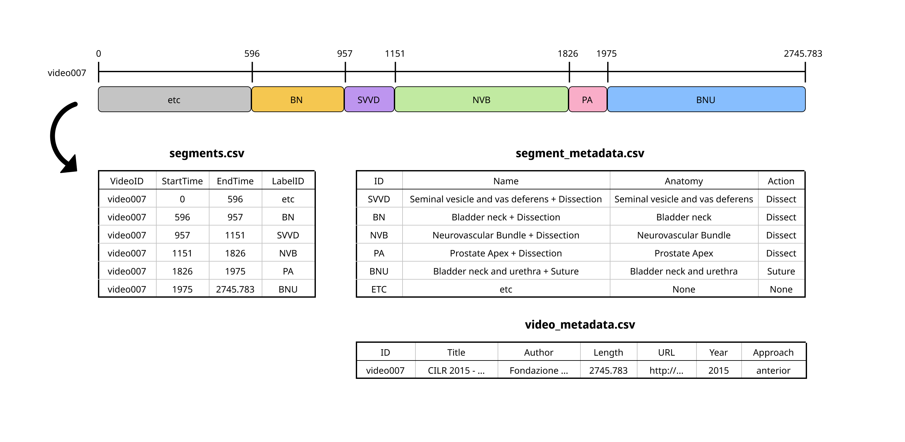

# Surch Dataset

Prostatectomy robotic surgery video dataset labeled with anatomy and surgical action for each timestamp

## Overview

We introduce a labeled dataset of prostatectomy robotic surgical videos. It contains data from a total of 296 videos (246 videos from Youtube, 50 videos from [MUSIC urology](https://www.musicurologyvideo.com/)), which are segmented into 3756 segments. It includes the labeling results of the anatomy and surgical actions covered in each part of the videos.

## Dataset Details

- segments.csv : Main dataset file. Each row represents a specific segment of the video. Each row includes video ID, start/end time of the segment (expressed in seconds), and label ID.
- video_metadata.csv : Details of each video in the dataset, including ID (which is used in segments.csv), title, author, length (expressed in seconds), URL, year of surgery, and surgical approach (anterior/posterior)
- segment_metadata.csv : Details of the labels used in the dataset, including ID (which is used in segments.csv), name of the label, anatomy, and surgical action

## Dataset Examples

## Licensing

- Labels are licensed under [Creative Commons Attribution 4.0 License](https://creativecommons.org/licenses/by/4.0/legalcode)

## Contact

This section will be added after the blind review process.

## Citations

This section will be added after the blind review process.
